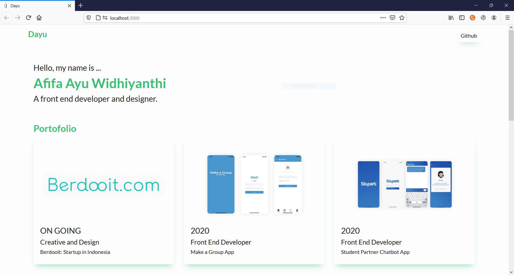

# MY PORTOFOLIO
#### Build with ReactJS
This is a landing page

### Web Screenshot

### Installation

1. Clone from GitHub

2. Installing node.js
> https://nodejs.org/en/download/

3. Installing ReactJS
` yarn install `

4. Run a website
` yarn start `

5. Open in browser with url:
` http://localhost:3000/ `

Made with ♡ by Dayu.
